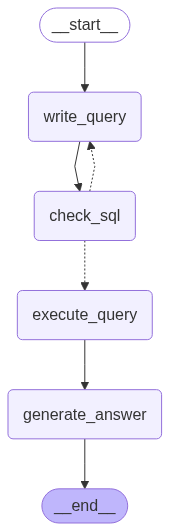

# freelancer_questions
```
pip install -r requirements.txt
cd app
python3 app.py ask 'Какой процент фрилансеров, считающих себя экспертами, выполнил менее 100 проектов?'
```

Активация просмотра всех состояний: 
```
python3 app.py setup --debug 
```

Загрузка датасета и создание бд:
```
python3 app.py load
  DATASET_URL: https://www.kaggle.com/api/v1/datasets/download/shohinurpervezshohan/freelancer-earnings-and-job-trends
  DATASET_NAME: freelancer_earnings_bd
  DB_PATH: data/freelancer_earnings_bd.db
```

Установка llm и провайдера: 
```
python3 app.py config --help
Usage: app.py config [OPTIONS]

  Installing an OpenAi API compatible model.

Options:
  --model TEXT     Name of model to use (for example, gpt-4, llama3, qwen3).
  --base_url TEXT  Base URL for API requests.
  --api_key TEXT   LLM provider API key.
  --help           Show this message and exit.
```
## 1. Подход к решению задачи и технологии
Для решения поставленной задачи необходимо:
* Загрузить датасет с kaggle.com и поместить его в SQL-хранилище (sqlite)
* Для взаимодействия с LLM выбран фреймворк LangChain, который позволяет создать последовательного агента для выполнения запросов.
* Для реализации интерфейса командной строки (CLI) используется библиотека Click.
## 2. Агент
Для выполнения поиска по базе данных агент должен последовательно выполнять следующие шаги:
1. Сгенерировать SQL-запрос с учётом диалекта используемой базы данных и формулировки пользовательского запроса (write_query).
2. Проверить соответствие запроса заданию. Так как решение универсально, можно использовать любую LLM-модель, поддерживающую форматированный ответ и совместимую со стандартом OpenAI API. В случае несоответствия запрос формируется повторно (по умолчанию — до 25 итераций) (check_sql).
3. Выполнить SQL-запрос в базе данных (execute_query).
4. Сформировать ответ пользователю, учитывая его вопрос и полученные из базы данные (generate_answer).



Трассировка прохода графа с первой попытки: https://smith.langchain.com/public/2e128814-d208-42fb-b53f-f07aefb09e4e/r

Трассировка несколько попыток генерации sql запроса: https://smith.langchain.com/public/e64cfc93-e57d-4098-9160-8dab7d7783f3/r
## 3. Эффективность и точность работы систем
Коллекция вопросов - freelancer_dataset_questions.txt
3 вопроса из задания и 30 сгенерированных
Система тестировалась на 3х моделях:
1. openai/gpt-4o-mini ~ 97% (dataset_62eaf4d5-fc3d-46fe-b259-49bba80b6ed3.csv)
2. google/gemini-2.5-flash-pre-05-20 ~ 68% (много перегенраций)
3. qwen3:4b ~ 91%

Существенную трудность вызвали последние 10 пользовательских запросов. Основная проблема заключалась в том, что они содержали точные указания на названия колонок, которые не соответствуют реальной структуре датасета. 

Gemini и qwen переодически пытались обратиться к этим колонкам.
## 4. Результаты
Получилась система которая абстрактна от предметной области и модели:

Лучшая точность на gpt-4o-mini: со средним временем выполнения 5.97s.

Оптимальная по цена-качеству qwen3:4b: со средним временем выполнения 202.41s (intel cpu 4gen).

